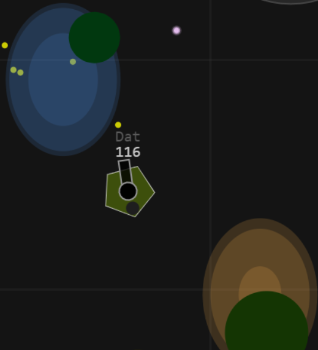

# GunGame2 :gun::runner::skull::musical_note:

 1. [Basic Controls](#how-to-play-basic)
 2.  [Advance Controls](#more-controls)
 3. [Objects In Game](#objects-in-game)
 4. 

## How to play  Basic : 

### Move, Collect, Kill, Upgrade, Survive :video_game::alien::sparkling_heart::collision:
The **winner** is the **last one alive**.
 
| **Action** | **Controls** | -- |
|--|--|--|
| **Move** | *A S D W* **or** *Keyboard Arrow*  | :arrow_up::arrow_down::arrow_left::arrow_right: |
| **Fire/Shoot** (click or hold)| *Left mouse* | :boom:  |
| **Change weapons** | *Scroll mouse wheel* **or** *numberkey* | :gun: |
| **Reload** | R | :arrows_counterclockwise: |
| **Shield** (on/off) | E | :radio_button: |
| **Pick up** (weapons)| F | :large_blue_diamond: |

### More Controls
| **Action** | **Controls** | -- |
|--|--|--|
| **Camera follow player** | V | :cinema: |
| **Pause / Resume**| ESC | :arrow_forward: |
|**Chat** (show/hide)| C | :door: |
|**Chat** (Add Message)| Enter | :speech_balloon: |
|**Minimap** (show/hide)| M | :earth_asia: |
|**Change music** (next song)| N | :musical_note: |
|**Help** (show help in chat box)| H | :question: |

## Objects In Game : 
This game contain a lot of objects ... :deciduous_tree::volcano::gem::heart: Each object has its own ability.

| # |Name | Decription |ScreenShot | Hint
|--|--|--|--|--|
|:heart:| Energy Particles | Collect to increase **health** and **size**| | Don't eat to much, **bigger** = more bullet **hit** you|
|:deciduous_tree:| Trees | A good place to **hide**. |  | Shoot it to get **free energy** particles. |
|:moyai:| Rocks | It is difficult to destroy, **reflect** all types of bullets. |  | Destroy it to get **powerful weapons**.
|:gun:| Dropped Weapons | Come close and **press F** to pick up. | | You can only have **up to 4 weapons**, Pick up a new one to **drop** the current one.
|:bomb:| Oil Barrels | Be **careful**, don't stand near when it's about to explode. |  | **Smoke** is a signal. There are **powerfull weapons** that fall off when it explodes. 
|:milky_way:| Portal gates | **IN gate** (blue) and **OUT gate** (orange), only work if 2 gates are **connected** |  | Portal is **one way**, you can't go back. |
|:sweat_drops:| Water area | **Slowdown everything** inside, even bullets |  | You can easily escape from enemy's bullets in this area. |
|:snowflake:| Ice area | **Speedup** players |  | Runnaway from enemies and bullets |
|:collision:| Danger area | **Not safety**, bombs falling here |  | A lot of **energy particles** are created in this area. 

## Maps :
There are **7  maps**  for you:

| # |Name| Decription | ScreenShot | Hint |
|--|--|--|--|--|
|:black_square_button:| **Flat** | Nothing here, No trees, No Rocks, No Barrels, ... |  | Best performance|
| :earth_asia: | **Normal** | Almost like the real world, full of objects |  | Best |
| :ocean::palm_tree::sun_with_face:| **Beach** |  |  |  |
|:evergreen_tree::deciduous_tree::waxing_crescent_moon:| **Jungle** |  |  |  |
|:snowflake::partly_sunny:| **Winter** |  |  |  |
|:volcano::snowflake::waxing_crescent_moon:| **Mountain** |  |  |  |
|:bomb::waxing_crescent_moon:| **Barrel** |  | |  |

> Written with [StackEdit](https://stackedit.io/).